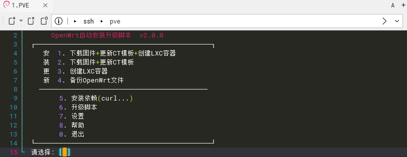

<a id="top"></a>


- [1 安装curl、wget、squashfs-tools工具](#artical_1)
- [2 PVE一键换源、去订阅等](#artical_2)
- [3 LXC容器OpenWrt安装、更新](#artical_3)

------

<br />
<a id="artical_1"></a>

### 1 安装curl、wget、squashfs-tools工具

温馨提示：以下请在`PVE命令行`中操作

使用root用户登录，执行以下命令

```shell
apt update && apt install -y curl wget squashfs-tools
```

<br />
<br />
<a id="artical_2"></a>

### 2 PVE一键换源、去订阅等

<br />

方式一：PVE中输入以下命令安装pve.sh，然后在PVE命令行中直接输入 **`pve`** 运行     **推荐**

```shell
wget https://mirror.ghproxy.com/https://raw.githubusercontent.com/roacn/pve/main/pve.sh -O /usr/bin/pve && chmod +x /usr/bin/pve
```
在PVE命令行中输入以下命令即可运行脚本

```shell
pve
```

<br />

方式二：直接运行

```shell
bash -c  "$(curl -fsSL https://mirror.ghproxy.com/https://raw.githubusercontent.com/roacn/pve/main/pve.sh)"
```

<br /><br />
<a id="artical_3"></a>

### 3 LXC容器OpenWrt安装、更新

<br />

#### 3.1 下载

<br />

方式一：PVE中直接使用 `openwrt`  命令运行自动安装更新脚本 **推荐**

```shell
wget https://mirror.ghproxy.com/https://raw.githubusercontent.com/roacn/pve/main/openwrt.lxc.sh -O /usr/bin/openwrt && chmod +x /usr/bin/openwrt
```

在PVE命令行中输入以下命令运行脚本，进行安装或更新操作！

```shell
openwrt
```

<br />

方式二：直接运行

```shell
bash -c  "$(curl -fsSL https://mirror.ghproxy.com/https://raw.githubusercontent.com/roacn/pve/main/openwrt.lxc.sh)"
```

完成！

<br />

#### 3.2 设置

<br />

固件下载相关

| 选项     | 说明                                                         | 默认值              |
| -------- | ------------------------------------------------------------ | ------------------- |
| 仓库地址 | github用户名称/仓库名称                                        | roacn/build-actions |
| TAG名称  | 所在release的tag名称                                          | AutoUpdate-x86-lxc  |
| API文件  | 所在release的附件api文件名称                                   | zzz_api             |
| 固件格式 | .tar.gz或.img.gz格式固件；<br />设置为default，默认获取云端两种格式固件；<br />设置为.tar.gz，则只获取云端.tar.gz格式固件；<br />设置为.img.gz，则只获取云端.img.gz格式固件 | default         |

<br />

OpenWrt容器相关

| 选项     | 说明                                   | 默认值  |
| -------- | -------------------------------------- | ------- |
| 容器ID   | lxc容器id，需要>=100                   | 100     |
| 容器名称 | lxc容器管理页面显示的名称              | OpenWrt |
| CPU核心  | lxc容器分配CPU核心数                   | 4       |
| 内存大小 | lxc容器分配内存大小，单位MB            | 1024    |
| 磁盘大小 | lxc容器分配磁盘大小，单位GB            | 2       |
| 交换分区 | lxc容器分配交换分区大小，单位MB        | 512     |
| 网络接口 | lxc容器分配的网络接口数量              | 1       |
| 开机自启 | 是否启用开机自启动，1为开启，0为不开启 | 1       |
| 启动顺序 | 在所有PVE虚拟机的启动排序              | 1       |


<br />

<br />



<br />

<br />

[返回顶部](#top)
